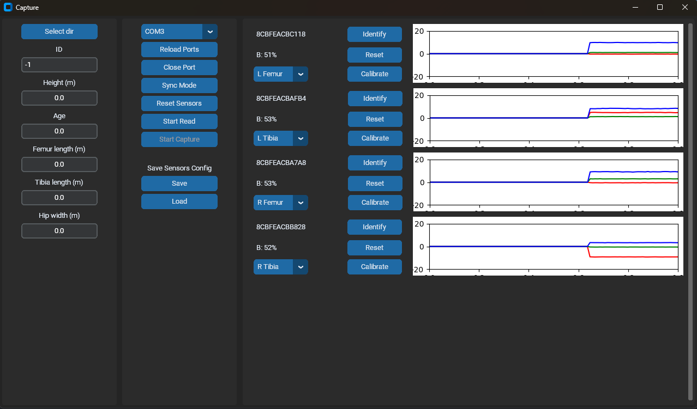

# Documentación de la Aplicación de Captura

Esta aplicación está diseñada para interactuar con sensores a través de una conexión serial, capturar datos de los mismos, visualizarlos en tiempo real y guardarlos en archivos CSV. Utiliza las bibliotecas `customtkinter`, `matplotlib`, `numpy`, `serial`, y una API personalizada (`McdAPI`).

## Interfaz


## Clase Principal: `App`

La clase `App` hereda de `customtkinter.CTk` y representa la ventana principal de la aplicación.

### `__init__` 

El constructor inicializa la interfaz gráfica de usuario (GUI), configurando el título, tamaño, y la disposición de los elementos.  La ventana se divide en tres marcos principales:

*   **`frame_left` (Izquierda):** Contiene controles para seleccionar el directorio de guardado de datos, ingresar un ID, y especificar medidas antropométricas (altura, edad, longitud de fémur, longitud de tibia, ancho de cadera).
*   **`frame_center` (Centro):** Contiene controles para la gestión de la conexión serial (selección de puerto, apertura/cierre), control de la lectura de datos (iniciar/detener), reinicio y sincronización de sensores, y opciones para guardar/cargar la configuración de los sensores.
*   **`frame_right` (Derecha):**  Es un marco desplazable (`CTkScrollableFrame`) que muestra dinámicamente la información de los sensores conectados, incluyendo gráficos en tiempo real de la aceleración en los ejes X, Y y Z, y el nivel de batería.

#### Elementos de la GUI y Variables Asociadas:

*   **Menú Izquierdo (`frame_left`):**
    *   `btn_select_dir`: Botón para seleccionar el directorio de guardado (llama a `select_dir`).
    *   `label_id`, `input_id`: Etiqueta y campo de entrada para el ID del conjunto de datos.
    *   `label_height`, `input_height`, `var_height`: Etiqueta, campo de entrada y variable (`DoubleVar`) para la altura.
    *   `label_age`, `input_age`, `var_age`: Etiqueta, campo de entrada y variable (`DoubleVar`) para la edad.
    *   `label_femur`, `input_femur`, `var_femur`: Etiqueta, campo de entrada y variable (`DoubleVar`) para la longitud del fémur.
    *   `label_tibia`, `input_tibia`, `var_tibia`: Etiqueta, campo de entrada y variable (`DoubleVar`) para la longitud de la tibia.
    *   `label_hip`, `input_hip`, `var_hip`: Etiqueta, campo de entrada y variable (`DoubleVar`) para el ancho de la cadera.

*   **Menú Central (`frame_center`):**
    *   `optionMenu_serial_port`: Menú desplegable para seleccionar el puerto serial (se actualiza con `btn_update_ports`).
    *   `btn_update_ports`: Botón para recargar la lista de puertos seriales disponibles.
    *   `mcd`: Instancia de la clase `McdAPI` para la comunicación serial.
    *   `btn_port`: Botón para abrir/cerrar el puerto serial (llama a `open_port` y `close_port`).
    *   `btn_read`: Botón para iniciar/detener la lectura de datos (llama a `start_read` y `stop_read`).  Se habilita/deshabilita según el estado de la conexión.
    *   `btn_reset`: Botón para reiniciar los sensores (llama a `mcd.reset_sensor`). Se habilita/deshabilita según el estado de la conexión.
    *   `btn_capture`: Botón para iniciar/detener la captura de datos (llama a `start_capture` y `stop_capture`). Se habilita/deshabilita según el estado de la lectura.
    *   `btn_sync`: Botón para activar el modo de sincronización de los sensores (llama a `mcd.sync_mode`). Se habilita/deshabilita según el estado de la conexión.
    *   `label_sensors_config`, `btn_save_config`, `btn_load_config`: Etiqueta y botones para guardar y cargar la configuración de los sensores (llaman a `save_config` y `load_config`).

*   **Menú Derecho (`frame_right`):**
    *   Contiene marcos generados dinámicamente para cada sensor detectado (ver `add_sensor` y `del_sensor`).

*   **Variables de Estado y Colas:**
    *   `dict_sensor`: Diccionario que almacena la información y los widgets de cada sensor.  La clave es la dirección del sensor.
    *   `config`: Diccionario que guarda la configuración de los sensores (qué hueso representa cada sensor).
    *   `queue_data`: Cola (`queue.Queue`) para almacenar los datos recibidos de los sensores.
    *   `queue_battery`: Cola (`queue.Queue`) para almacenar la información de la batería de los sensores.
    *   `capture_flag`: Cola (`queue.Queue`) para controlar el estado de la captura de datos (iniciada/detenida).
    *   `process`: Hilo (`threading.Thread`) que ejecuta la función `read_capture_process` para la lectura y procesamiento de datos en segundo plano.
    *    `after_update_sensors_id`, `after_graphs_id`: Identificadores para las tareas programadas con `after` que actualizan los sensores y gráficos.


### Métodos Principales:

*   **`select_dir(self)`:** Abre un diálogo para seleccionar el directorio de guardado y actualiza `self.dataset_path`.

*   **`open_port(self)`:** Establece el puerto serial en la instancia de `McdAPI`, intenta conectarse y actualiza la GUI en consecuencia (habilita/deshabilita botones, inicia el hilo de lectura, etc.).  Inicializa las colas de datos y el hilo `process`. Llama a `update_sensors`.

*   **`close_port(self)`:** Detiene la lectura, cierra el puerto serial, actualiza la GUI (botones) y elimina la información de los sensores del `frame_right`. Cancela las llamadas `after`.

*   **`start_read(self)`:** Inicia la lectura de datos llamando a `mcd.read_start()` y actualiza la GUI. Inicia la actualizacion de graficos con `update_graphs`.

*   **`stop_read(self)`:** Detiene la lectura de datos llamando a `mcd.read_stop()` y actualiza la GUI. Cancela la llamada `after`.

*   **`start_capture(self)`:** Inicia la captura de datos.  Prepara un comentario con los datos antropométricos, la ruta de guardado y el nombre del archivo. Guarda la configuración de los sensores y envía una señal a través de `capture_flag` para iniciar la escritura en el archivo CSV.

*   **`stop_capture(self)`:** Detiene la captura de datos enviando una señal a través de `capture_flag`.

*   **`add_sensor(self, addr, battery)`:** Agrega un nuevo sensor a la interfaz (en `frame_right`). Crea un marco (`CTkFrame`) para el sensor, que incluye:
    *   Etiqueta con la dirección del sensor (`address`).
    *   Etiqueta con el nivel de batería (`battery`).
    *   Menú desplegable para seleccionar el hueso asociado al sensor (`select_bone`, `var_bone`).
    *   Botones para identificar, reiniciar y calibrar el sensor (`btn_identify`, `btn_reset`, `btn_calibrate`).
    *   Un sub-marco (`frame_graph`) que contiene un gráfico de matplotlib (`fig`, `ax`) para visualizar la aceleración en los ejes X, Y y Z.

*   **`del_sensor(self, addr)`:** Elimina un sensor de la interfaz (de `frame_right`) y del diccionario `dict_sensor`. Cierra la figura de matplotlib.

*   **`update_sensors(self)`:** Se ejecuta periódicamente (cada 1000 ms) usando `self.after`.  Obtiene datos de la batería de `queue_battery`.  Agrega nuevos sensores (si aparecen en los datos recibidos), actualiza el nivel de batería de los sensores existentes y elimina los sensores que ya no se detectan. Tambien asigna a cada sensor la parte del esqueleto correspondiente usando la configuracion cargada o "Select" en caso de no existir configuracion.

*   **`update_graphs(self)`:** Se ejecuta periódicamente (cada 16 ms) usando `self.after`.  Obtiene datos de `queue_data`. Actualiza los gráficos de aceleración de cada sensor con los nuevos datos.

*   **`save_config(self)`:** Guarda la configuración actual de los sensores (qué hueso representa cada sensor) en un archivo CSV. Pregunta al usuario por el nombre del archivo a través de un diálogo.

*   **`load_config(self)`:** Carga una configuración de sensores desde un archivo CSV. Pregunta al usuario por el archivo a través de un diálogo. Guarda la configuración en el diccionario `self.config`.

*   **`on_closing(self)`:**  Manejador del evento de cierre de la ventana.  Detiene la captura, la lectura, cierra el puerto serial y destruye la ventana de la aplicación. Cancela cualquier llamada a `after` programada.

## Función: `read_capture_process`

Esta función se ejecuta en un hilo separado y se encarga de la lectura continua de datos desde el puerto serial, el procesamiento de los paquetes de datos, la actualización de las colas `queue_data` y `queue_battery`, y la escritura de los datos capturados en un archivo CSV.

### Argumentos:

*   `mcd`: Instancia de la clase `McdAPI`.
*   `capture_flag`: Cola (`queue.Queue`) para controlar el estado de la captura.
*   `queue_data`: Cola para los datos de los sensores.
*   `queue_battery`: Cola para los datos de la batería.

### Funcionamiento:

1.  **Bucle Principal:** El bucle `while True` se ejecuta indefinidamente hasta que se cierre el puerto serial.

2.  **Control de Captura:** Comprueba si hay mensajes en `capture_flag`. Si hay un mensaje, se inicia o detiene la captura, según el contenido del mensaje.  Si se inicia la captura, se crea un nuevo archivo CSV (con un nombre único) y se inicializa un escritor CSV (`csv_writer`).  La configuración de los sensores (`config`) se invierte (de hueso a dirección).

3.  **Lectura de Datos:**  Lee datos del puerto serial usando `mcd.read()` y los acumula en un búfer (`buffer`).

4.  **Procesamiento de Paquetes:** Busca el byte de inicio de trama ('S').  Según el tipo de mensaje (datos o batería), extrae la longitud del paquete y espera a recibir todos los bytes necesarios.
    *   **Mensajes de Datos (tipo 1):**  Desempaqueta los datos usando `unpack_data` y el formato `FORMAT_DATA`.  Agrega los datos a `queue_data`. Si la captura está activa, escribe una fila en el archivo CSV con los datos del timestamp y los valores de aceleración, giroscopio y cuaternión de cada sensor, según la configuración cargada.
    *   **Mensajes de Batería (tipo 2):** Desempaqueta los datos usando `unpack_bat` y el formato `FORMAT_BAT`. Agrega los datos a `queue_battery`.

5.  **Manejo de Errores:**  Incluye un bloque `try...except` para manejar `KeyboardInterrupt` (para salir limpiamente) y otras excepciones.

## Función: `init_csv_file`

Esta función auxiliar inicializa un archivo CSV para la captura de datos.

### Argumentos:

*   `path`: Ruta del archivo CSV.
*   `fields`: Lista de nombres de campo para la cabecera del CSV.
*   `delimiter`: Carácter delimitador.
*   `comments`: Comentarios opcionales para agregar al inicio del archivo.

### Retorno:

*   Una tupla que contiene el objeto de archivo abierto y el objeto `csv.DictWriter`.

## Ejecución Principal (`if __name__ == "__main__":`)

Crea una instancia de la clase `App`, configura el manejador del evento de cierre de la ventana (`on_closing`) y ejecuta el bucle principal de la aplicación (`mainloop`). Esto inicia la interfaz gráfica y el proceso de lectura/captura.

### Sistema de archivos de Dataset
Cuando realiza una serie de capturas a diferentes usuarios, estas deben de organizarse de alguna manera, este progama organiza los archivos en la ruta seleccionada con el boton `Select dir`, dentro de esta se crearan carpetas con los nombres asignados al espacio `ID`. dentro de esta carpeta se crearan archivos con el nombre `mcd-*.csv` siendo `*` el numero de captura, empezara buscando disponibilidad de nombre con `mcd-0.csv`, si no esta disponible continuara con `mcd-1.csv`, luego `mcd-2.csv` hasta que encuentre un numero no usado.
Ejemplo:
```Bash
DataSet
├───ID0
│   ├───mcd-0.csv
│   ├───mcd-1.csv
│   └───mcd-2.csv
├───ID1
│   ├───mcd-0.csv
│   ├───mcd-1.csv
│   └───mcd-2.csv
└───ID2
    ├───mcd-0.csv
    ├───mcd-1.csv
    └───mcd-2.csv        
```